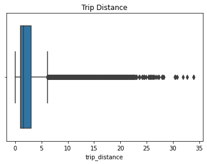
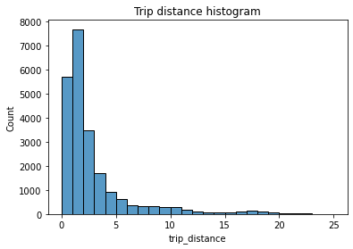
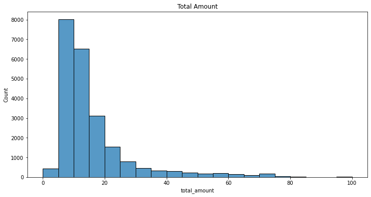
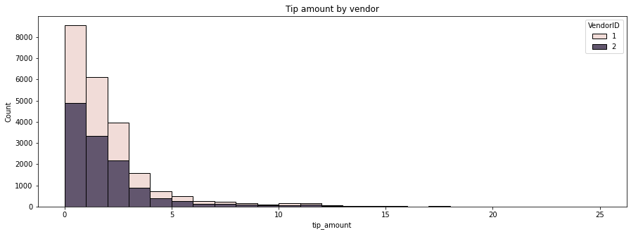
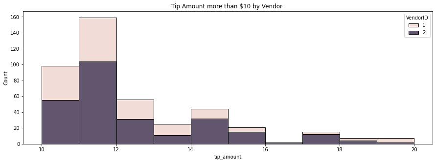
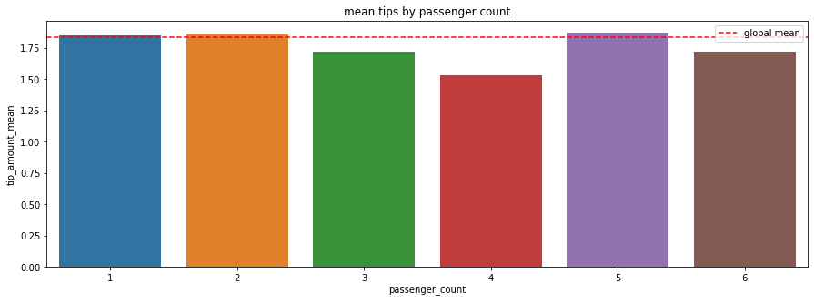
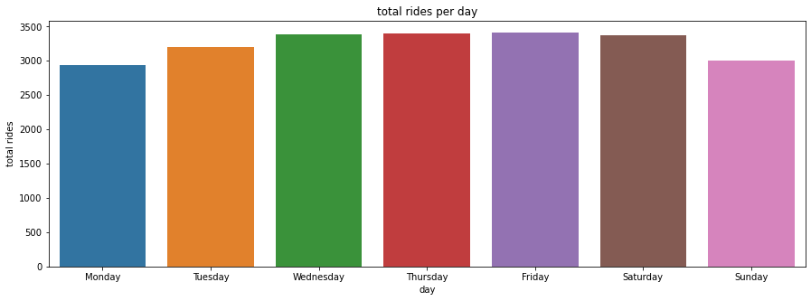
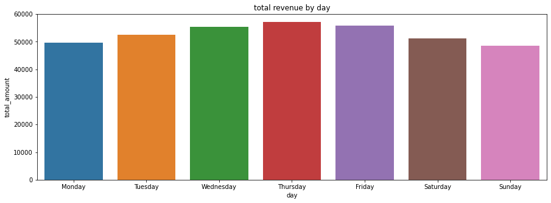
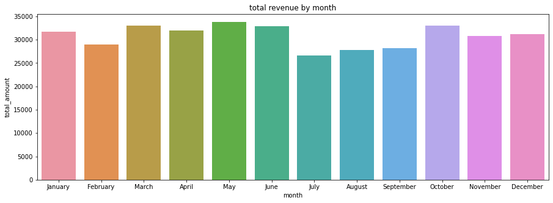
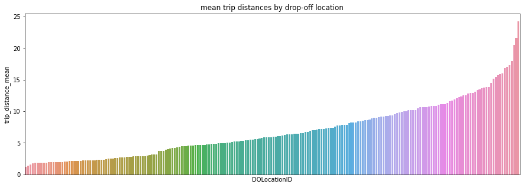

# **Course 3 Automatidata project**
**Course 3 - Go Beyond the Numbers: Translate Data into Insights**

You are the newest data professional in a fictional data consulting firm: Automatidata. The team is still early into the project, having only just completed an initial plan of action and some early Python coding work. 

Luana Rodriquez, the senior data analyst at Automatidata, is pleased with the work you have already completed and requests your assistance with some EDA and data visualization work for the New York City Taxi and Limousine Commission project (New York City TLC) to get a general understanding of what taxi ridership looks like. The management team is asking for a Python notebook showing data structuring and cleaning, as well as any matplotlib/seaborn visualizations plotted to help understand the data. At the very least, include a box plot of the ride durations and some time series plots, like a breakdown by quarter or month. 

Additionally, the management team has recently asked all EDA to include Tableau visualizations. For this taxi data, create a Tableau dashboard showing a New York City map of taxi/limo trips by month. Make sure it is easy to understand to someone who isn’t data savvy, and remember that the assistant director at the New York City TLC is a person with visual impairments.

A notebook was structured and prepared to help you in this project. Please complete the following questions.

# Course 3 End-of-course project: Exploratory data analysis

In this activity, you will examine data provided and prepare it for analysis. You will also design a professional data visualization that tells a story, and will help data-driven decisions for business needs. 

Please note that the Tableau visualization activity is optional, and will not affect your completion of the course. Completing the Tableau activity will help you practice planning out and plotting a data visualization based on a specific business need. The structure of this activity is designed to emulate the proposals you will likely be assigned in your career as a data professional. Completing this activity will help prepare you for those career moments.

**The purpose** of this project is to conduct exploratory data analysis on a provided data set. Your mission is to continue the investigation you began in C2 and perform further EDA on this data with the aim of learning more about the variables. 
  
**The goal** is to clean data set and create a visualization.
<br/>  
*This activity has 4 parts:*

**Part 1:** Imports, links, and loading

**Part 2:** Data Exploration
*   Data cleaning


**Part 3:** Building visualizations

**Part 4:** Evaluate and share results

<br/> 
Follow the instructions and answer the questions below to complete the activity. Then, you will complete an Executive Summary using the questions listed on the PACE Strategy Document.

Be sure to complete this activity before moving on. The next course item will provide you with a completed exemplar to compare to your own work. 


# **Visualize a story in Tableau and Python**

# **PACE stages** 


   *        [Plan](#scrollTo=psz51YkZVwtN&line=3&uniqifier=1)
   *        [Analyze](#scrollTo=mA7Mz_SnI8km&line=4&uniqifier=1)
   *        [Construct](#scrollTo=Lca9c8XON8lc&line=2&uniqifier=1)
   *        [Execute](#scrollTo=401PgchTPr4E&line=2&uniqifier=1)

Throughout these project notebooks, you'll see references to the problem-solving framework PACE. The following notebook components are labeled with the respective PACE stage: Plan, Analyze, Construct, and Execute.


## PACE: Plan 

In this stage, consider the following questions where applicable to complete your code response:
1. Identify any outliers: 


*   What methods are best for identifying outliers?
*   How do you make the decision to keep or exclude outliers from any future models?


==> ENTER YOUR RESPONSE HERE
Use numpy functions to investigate the mean() and median() of the data and understand range of data values
Use a boxplot to visualize the distribution of the data
Use histograms to visualize the distribution of the data

There are three main options for dealing with outliers: keeping them as they are, deleting them, or reassigning them. Whether you keep outliers as they are, delete them, or reassign values is a decision that you make taking into account the nature of the outlying data and the assumptions of the model you are building. To help you make the decision, you can start with these general guidelines:

Delete them: If you are sure the outliers are mistakes, typos, or errors and the dataset will be used for modeling or machine learning, then you are more likely to decide to delete outliers. Of the three choices, you’ll use this one the least.

Reassign them: If the dataset is small and/or the data will be used for modeling or machine learning, you are more likely to choose a path of deriving new values to replace the outlier values.

Leave them: For a dataset that you plan to do EDA/analysis on and nothing else, or for a dataset you are preparing for a model that is resistant to outliers, it is most likely that you are going to leave them in.

### Task 1. Imports, links, and loading
Go to Tableau Public
The following link will help you complete this activity. Keep Tableau Public open as you proceed to the next steps. 

Link to supporting materials: 
Tableau Public: https://public.tableau.com/s/ 

For EDA of the data, import the data and packages that would be most helpful, such as pandas, numpy and matplotlib. 


```python
# Import packages and libraries
#==> ENTER YOUR CODE HERE
import numpy as np
import pandas as pd
import matplotlib.pyplot as plt
import seaborn as sns
```

**Note:** As shown in this cell, the dataset has been automatically loaded in for you. You do not need to download the .csv file, or provide more code, in order to access the dataset and proceed with this lab. Please continue with this activity by completing the following instructions.


```python
# Load dataset into dataframe
df = pd.read_csv('2017_Yellow_Taxi_Trip_Data.csv')
```


## PACE: Analyze 

Consider the questions in your PACE Strategy Document to reflect on the Analyze stage.

### Task 2a. Data exploration and cleaning

Decide which columns are applicable

The first step is to assess your data. Check the Data Source page on Tableau Public to get a sense of the size, shape and makeup of the data set. Then answer these questions to yourself: 

Given our scenario, which data columns are most applicable? 
Which data columns can I eliminate, knowing they won’t solve our problem scenario? 

Consider functions that help you understand and structure the data. 

*    head()
*    describe()
*    info()
*    groupby()
*    sortby()

What do you do about missing data (if any)? 

Are there data outliers? What are they and how might you handle them? 

What do the distributions of your variables tell you about the question you're asking or the problem you're trying to solve?


==> ENTER YOUR RESPONSE HERE

Start by discovering, using head and size. 


```python
#==> ENTER YOUR CODE HERE
df.tail()
```


<div>
<style scoped>
    .dataframe tbody tr th:only-of-type {
        vertical-align: middle;
    }

    .dataframe tbody tr th {
        vertical-align: top;
    }

    .dataframe thead th {
        text-align: right;
    }
</style>
<table border="1" class="dataframe">
  <thead>
    <tr style="text-align: right;">
      <th></th>
      <th>Unnamed: 0</th>
      <th>VendorID</th>
      <th>tpep_pickup_datetime</th>
      <th>tpep_dropoff_datetime</th>
      <th>passenger_count</th>
      <th>trip_distance</th>
      <th>RatecodeID</th>
      <th>store_and_fwd_flag</th>
      <th>PULocationID</th>
      <th>DOLocationID</th>
      <th>payment_type</th>
      <th>fare_amount</th>
      <th>extra</th>
      <th>mta_tax</th>
      <th>tip_amount</th>
      <th>tolls_amount</th>
      <th>improvement_surcharge</th>
      <th>total_amount</th>
    </tr>
  </thead>
  <tbody>
    <tr>
      <th>22694</th>
      <td>14873857</td>
      <td>2</td>
      <td>02/24/2017 5:37:23 PM</td>
      <td>02/24/2017 5:40:39 PM</td>
      <td>3</td>
      <td>0.61</td>
      <td>1</td>
      <td>N</td>
      <td>48</td>
      <td>186</td>
      <td>2</td>
      <td>4.0</td>
      <td>1.0</td>
      <td>0.5</td>
      <td>0.00</td>
      <td>0.00</td>
      <td>0.3</td>
      <td>5.80</td>
    </tr>
    <tr>
      <th>22695</th>
      <td>66632549</td>
      <td>2</td>
      <td>08/06/2017 4:43:59 PM</td>
      <td>08/06/2017 5:24:47 PM</td>
      <td>1</td>
      <td>16.71</td>
      <td>2</td>
      <td>N</td>
      <td>132</td>
      <td>164</td>
      <td>1</td>
      <td>52.0</td>
      <td>0.0</td>
      <td>0.5</td>
      <td>14.64</td>
      <td>5.76</td>
      <td>0.3</td>
      <td>73.20</td>
    </tr>
    <tr>
      <th>22696</th>
      <td>74239933</td>
      <td>2</td>
      <td>09/04/2017 2:54:14 PM</td>
      <td>09/04/2017 2:58:22 PM</td>
      <td>1</td>
      <td>0.42</td>
      <td>1</td>
      <td>N</td>
      <td>107</td>
      <td>234</td>
      <td>2</td>
      <td>4.5</td>
      <td>0.0</td>
      <td>0.5</td>
      <td>0.00</td>
      <td>0.00</td>
      <td>0.3</td>
      <td>5.30</td>
    </tr>
    <tr>
      <th>22697</th>
      <td>60217333</td>
      <td>2</td>
      <td>07/15/2017 12:56:30 PM</td>
      <td>07/15/2017 1:08:26 PM</td>
      <td>1</td>
      <td>2.36</td>
      <td>1</td>
      <td>N</td>
      <td>68</td>
      <td>144</td>
      <td>1</td>
      <td>10.5</td>
      <td>0.0</td>
      <td>0.5</td>
      <td>1.70</td>
      <td>0.00</td>
      <td>0.3</td>
      <td>13.00</td>
    </tr>
    <tr>
      <th>22698</th>
      <td>17208911</td>
      <td>1</td>
      <td>03/02/2017 1:02:49 PM</td>
      <td>03/02/2017 1:16:09 PM</td>
      <td>1</td>
      <td>2.10</td>
      <td>1</td>
      <td>N</td>
      <td>239</td>
      <td>236</td>
      <td>1</td>
      <td>11.0</td>
      <td>0.0</td>
      <td>0.5</td>
      <td>2.35</td>
      <td>0.00</td>
      <td>0.3</td>
      <td>14.15</td>
    </tr>
  </tbody>
</table>
</div>


```python
#==> ENTER YOUR CODE HERE
df.size
```


    408582


Use describe... 


```python
#==> ENTER YOUR CODE HERE
df.describe()
```


<div>
<style scoped>
    .dataframe tbody tr th:only-of-type {
        vertical-align: middle;
    }

    .dataframe tbody tr th {
        vertical-align: top;
    }

    .dataframe thead th {
        text-align: right;
    }
</style>
<table border="1" class="dataframe">
  <thead>
    <tr style="text-align: right;">
      <th></th>
      <th>Unnamed: 0</th>
      <th>VendorID</th>
      <th>passenger_count</th>
      <th>trip_distance</th>
      <th>RatecodeID</th>
      <th>PULocationID</th>
      <th>DOLocationID</th>
      <th>payment_type</th>
      <th>fare_amount</th>
      <th>extra</th>
      <th>mta_tax</th>
      <th>tip_amount</th>
      <th>tolls_amount</th>
      <th>improvement_surcharge</th>
      <th>total_amount</th>
    </tr>
  </thead>
  <tbody>
    <tr>
      <th>count</th>
      <td>2.269900e+04</td>
      <td>22699.000000</td>
      <td>22699.000000</td>
      <td>22699.000000</td>
      <td>22699.000000</td>
      <td>22699.000000</td>
      <td>22699.000000</td>
      <td>22699.000000</td>
      <td>22699.000000</td>
      <td>22699.000000</td>
      <td>22699.000000</td>
      <td>22699.000000</td>
      <td>22699.000000</td>
      <td>22699.000000</td>
      <td>22699.000000</td>
    </tr>
    <tr>
      <th>mean</th>
      <td>5.675849e+07</td>
      <td>1.556236</td>
      <td>1.642319</td>
      <td>2.913313</td>
      <td>1.043394</td>
      <td>162.412353</td>
      <td>161.527997</td>
      <td>1.336887</td>
      <td>13.026629</td>
      <td>0.333275</td>
      <td>0.497445</td>
      <td>1.835781</td>
      <td>0.312542</td>
      <td>0.299551</td>
      <td>16.310502</td>
    </tr>
    <tr>
      <th>std</th>
      <td>3.274493e+07</td>
      <td>0.496838</td>
      <td>1.285231</td>
      <td>3.653171</td>
      <td>0.708391</td>
      <td>66.633373</td>
      <td>70.139691</td>
      <td>0.496211</td>
      <td>13.243791</td>
      <td>0.463097</td>
      <td>0.039465</td>
      <td>2.800626</td>
      <td>1.399212</td>
      <td>0.015673</td>
      <td>16.097295</td>
    </tr>
    <tr>
      <th>min</th>
      <td>1.212700e+04</td>
      <td>1.000000</td>
      <td>0.000000</td>
      <td>0.000000</td>
      <td>1.000000</td>
      <td>1.000000</td>
      <td>1.000000</td>
      <td>1.000000</td>
      <td>-120.000000</td>
      <td>-1.000000</td>
      <td>-0.500000</td>
      <td>0.000000</td>
      <td>0.000000</td>
      <td>-0.300000</td>
      <td>-120.300000</td>
    </tr>
    <tr>
      <th>25%</th>
      <td>2.852056e+07</td>
      <td>1.000000</td>
      <td>1.000000</td>
      <td>0.990000</td>
      <td>1.000000</td>
      <td>114.000000</td>
      <td>112.000000</td>
      <td>1.000000</td>
      <td>6.500000</td>
      <td>0.000000</td>
      <td>0.500000</td>
      <td>0.000000</td>
      <td>0.000000</td>
      <td>0.300000</td>
      <td>8.750000</td>
    </tr>
    <tr>
      <th>50%</th>
      <td>5.673150e+07</td>
      <td>2.000000</td>
      <td>1.000000</td>
      <td>1.610000</td>
      <td>1.000000</td>
      <td>162.000000</td>
      <td>162.000000</td>
      <td>1.000000</td>
      <td>9.500000</td>
      <td>0.000000</td>
      <td>0.500000</td>
      <td>1.350000</td>
      <td>0.000000</td>
      <td>0.300000</td>
      <td>11.800000</td>
    </tr>
    <tr>
      <th>75%</th>
      <td>8.537452e+07</td>
      <td>2.000000</td>
      <td>2.000000</td>
      <td>3.060000</td>
      <td>1.000000</td>
      <td>233.000000</td>
      <td>233.000000</td>
      <td>2.000000</td>
      <td>14.500000</td>
      <td>0.500000</td>
      <td>0.500000</td>
      <td>2.450000</td>
      <td>0.000000</td>
      <td>0.300000</td>
      <td>17.800000</td>
    </tr>
    <tr>
      <th>max</th>
      <td>1.134863e+08</td>
      <td>2.000000</td>
      <td>6.000000</td>
      <td>33.960000</td>
      <td>99.000000</td>
      <td>265.000000</td>
      <td>265.000000</td>
      <td>4.000000</td>
      <td>999.990000</td>
      <td>4.500000</td>
      <td>0.500000</td>
      <td>200.000000</td>
      <td>19.100000</td>
      <td>0.300000</td>
      <td>1200.290000</td>
    </tr>
  </tbody>
</table>
</div>


And info. 


```python
#==> ENTER YOUR CODE HERE
df.info()
```

    <class 'pandas.core.frame.DataFrame'>
    RangeIndex: 22699 entries, 0 to 22698
    Data columns (total 18 columns):
     #   Column                 Non-Null Count  Dtype  
    ---  ------                 --------------  -----  
     0   Unnamed: 0             22699 non-null  int64  
     1   VendorID               22699 non-null  int64  
     2   tpep_pickup_datetime   22699 non-null  object 
     3   tpep_dropoff_datetime  22699 non-null  object 
     4   passenger_count        22699 non-null  int64  
     5   trip_distance          22699 non-null  float64
     6   RatecodeID             22699 non-null  int64  
     7   store_and_fwd_flag     22699 non-null  object 
     8   PULocationID           22699 non-null  int64  
     9   DOLocationID           22699 non-null  int64  
     10  payment_type           22699 non-null  int64  
     11  fare_amount            22699 non-null  float64
     12  extra                  22699 non-null  float64
     13  mta_tax                22699 non-null  float64
     14  tip_amount             22699 non-null  float64
     15  tolls_amount           22699 non-null  float64
     16  improvement_surcharge  22699 non-null  float64
     17  total_amount           22699 non-null  float64
    dtypes: float64(8), int64(7), object(3)
    memory usage: 3.1+ MB


### Task 2b. Assess whether dimensions and measures are correct

On the data source page in Tableau, double check the data types for the applicable columns you selected on the previous step. Pay close attention to the dimensions and measures to assure they are correct. 

In Python, consider the data types of the columns. *Consider:* Do they make sense? 

Review the link provided in the previous activity instructions to create the required Tableau visualization. 

### Task 2c. Select visualization type(s)

Select data visualization types that will help you understand and explain the data.

Now that you know which data columns you’ll use, it is time to decide which data visualization makes the most sense for EDA of the TLC dataset. What type of data visualization(s) would be most helpful? 

* Line graph
* Bar chart
* Box plot
* Histogram
* Heat map
* Scatter plot
* A geographic map


==> ENTER YOUR RESPONSE HERE
As you'll see below, a bar chart, box plot and scatter plot will be most helpful in your understanding of this data.

A box plot will be helpful to determine outliers and where the bulk of the data points reside in terms of trip_distance, duration, and total_amount

A scatter plot will be helpful to visualize the trends and patters and outliers of critical variables, such as trip_distance and total_amount

A bar chart will help determine average number of trips per month, weekday, weekend, etc.


## PACE: Construct 

Consider the questions in your PACE Strategy Document to reflect on the Construct stage.

### Task 3. Data visualization

You’ve assessed your data, and decided on which data variables are most applicable. It’s time to plot your visualization(s)!


### Boxplots

Perform a check for outliers on relevant columns such as trip distance and trip duration. Remember, some of the best ways to identify the presence of outliers in data are box plots and histograms. 

**Note:** Remember to convert your date columns to datetime in order to derive total trip duration.  


```python
# Convert data columns to datetime
#==> ENTER YOUR CODE HERE
df['tpep_pickup_datetime'] = pd.to_datetime(df['tpep_pickup_datetime'])
df['tpep_dropoff_datetime'] = pd.to_datetime(df['tpep_dropoff_datetime'])
```

**trip distance**


```python
# Create box plot of trip_distance
#==> ENTER YOUR CODE HERE
sns.boxplot(data = df,
           x = 'trip_distance')
plt.title('Trip Distance')
```


    Text(0.5, 1.0, 'Trip Distance')





```python
# Create histogram of trip_distance
#==> ENTER YOUR CODE HERE
sns.histplot(data = df,
             x = 'trip_distance', 
             bins=range(0,26,1))
plt.title('Trip distance histogram');
```





```python
# Note: The majority of trips were journeys of less than two miles. 
# The number of trips falls away steeply as the distance traveled increases beyond two miles.
```

**total amount**


```python
# Create box plot of total_amount
#==> ENTER YOUR CODE HERE
sns.boxplot(data = df,
           x = 'total_amount')
plt.title('Total Amount')
```


    Text(0.5, 1.0, 'Total Amount')


```python
# Create histogram of total_amount
#==> ENTER YOUR CODE HERE
plt.figure(figsize=(12,6))
sns.histplot(data = df,
            x = 'total_amount',
            bins = range(0,101,5))
plt.title('Total Amount')
```


    Text(0.5, 1.0, 'Total Amount')





```python
#  Note: The total cost of each trip also has a distribution that skews right, with most costs falling in the $5-15 range.
```

**tip amount**


```python
# Create box plot of tip_amount
#==> ENTER YOUR CODE HERE
plt.figure(figsize = (20,5))
sns.boxplot(data = df,
           x = 'tip_amount')
plt.title('Tip Amount')
```


    Text(0.5, 1.0, 'Tip Amount')


```python
# Create histogram of tip_amount
#==> ENTER YOUR CODE HERE
plt.figure(figsize = (20,5))
sns.histplot(data = df,
            x = 'tip_amount',
            bins = range(0,26,1))
plt.title('Tip Amount')
```


    Text(0.5, 1.0, 'Tip Amount')


```python
# Note: The distribution for tip amount is right-skewed, with nearly all the tips in the $0-3 range.
```

**tip_amount by vendor**


```python
# Create histogram of tip_amount by vendor
#==> ENTER YOUR CODE HERE
plt.figure(figsize = (15,5))
sns.histplot(data = df,
            x = 'tip_amount',
            bins = range(0,26,1),
            hue = 'VendorID',
            multiple='stack')
plt.title('Tip amount by vendor')
```


    Text(0.5, 1.0, 'Tip amount by vendor')





```python
# Note: Separating the tip amount by vendor reveals that there are no noticeable aberrations in the distribution of tips 
# between the two vendors in the dataset. Vendor two has a slightly higher share of the rides, and this proportion is 
# approximately maintained for all tip amounts.
```

Next, zoom in on the upper end of the range of tips to check whether vendor one gets noticeably more of the most generous tips.


```python
# Create histogram of tip_amount by vendor for tips > $10 
#==> ENTER YOUR CODE HERE
tips_over_ten = df[df['tip_amount'] > 10]
plt.figure(figsize = (15,5))
sns.histplot(data = tips_over_ten,
            x = 'tip_amount',
            hue = 'VendorID',
            bins = range(10,21,1),
            multiple='stack')
plt.title('Tip Amount more than $10 by Vendor ')
```


    Text(0.5, 1.0, 'Tip Amount more than $10 by Vendor ')





```python
# Note: The proportions are maintained even at these higher tip amounts, with the exception being at highest extremity, 
# but this is not noteworthy due to the low sample size at these tip amounts.
```

**Mean tips by passenger count**

Examine the unique values in the `passenger_count` column.


```python
#==> ENTER YOUR CODE HERE
df['passenger_count'].value_counts()
```


    1    16117
    2     3305
    5     1143
    3      953
    6      693
    4      455
    0       33
    Name: passenger_count, dtype: int64


```python
# Note: Nearly two thirds of the rides were single occupancy, though there were still nearly 700 rides with as many as six 
# passengers. Also, there are 33 rides with an occupancy count of zero, which doesn't make sense. These would likely be dropped 
# unless a reasonable explanation can be found for them.
```


```python
# Calculate mean tips by passenger_count
#==> ENTER YOUR CODE HERE
passenger_mean = df.groupby(['passenger_count']).mean()[['tip_amount']].rename(columns = {'tip_amount':'tip_amount_mean'}).reset_index()
passenger_mean
```


<div>
<style scoped>
    .dataframe tbody tr th:only-of-type {
        vertical-align: middle;
    }

    .dataframe tbody tr th {
        vertical-align: top;
    }

    .dataframe thead th {
        text-align: right;
    }
</style>
<table border="1" class="dataframe">
  <thead>
    <tr style="text-align: right;">
      <th></th>
      <th>passenger_count</th>
      <th>tip_amount_mean</th>
    </tr>
  </thead>
  <tbody>
    <tr>
      <th>0</th>
      <td>0</td>
      <td>2.135758</td>
    </tr>
    <tr>
      <th>1</th>
      <td>1</td>
      <td>1.848920</td>
    </tr>
    <tr>
      <th>2</th>
      <td>2</td>
      <td>1.856378</td>
    </tr>
    <tr>
      <th>3</th>
      <td>3</td>
      <td>1.716768</td>
    </tr>
    <tr>
      <th>4</th>
      <td>4</td>
      <td>1.530264</td>
    </tr>
    <tr>
      <th>5</th>
      <td>5</td>
      <td>1.873185</td>
    </tr>
    <tr>
      <th>6</th>
      <td>6</td>
      <td>1.720260</td>
    </tr>
  </tbody>
</table>
</div>


```python
# Create bar plot for mean tips by passenger count
#==> ENTER YOUR CODE HERE
plt.figure(figsize = (15,5))
passenger_mean = passenger_mean.tail(-1)
ax = sns.barplot(data = passenger_mean,
           x = 'passenger_count',
           y = 'tip_amount_mean')
ax.axhline(df['tip_amount'].mean(), ls='--', color='red', label='global mean')
plt.title('mean tips by passenger count')
ax.legend()
plt.show()
```





```python
# Note: Mean tip amount varies very little by passenger count. Although it does drop noticeably for four-passenger rides, 
# it's expected that there would be a higher degree of fluctuation because rides with four passengers were the least plentiful 
# in the dataset (aside from rides with zero passengers).
```

**Create month and day columns**


```python
# Create a month column
#==> ENTER YOUR CODE HERE
df['month'] = df['tpep_pickup_datetime'].dt.month_name()
# Create a day column
#==> ENTER YOUR CODE HERE
df['day'] = df['tpep_pickup_datetime'].dt.day_name()
df.head()
```


<div>
<style scoped>
    .dataframe tbody tr th:only-of-type {
        vertical-align: middle;
    }

    .dataframe tbody tr th {
        vertical-align: top;
    }

    .dataframe thead th {
        text-align: right;
    }
</style>
<table border="1" class="dataframe">
  <thead>
    <tr style="text-align: right;">
      <th></th>
      <th>Unnamed: 0</th>
      <th>VendorID</th>
      <th>tpep_pickup_datetime</th>
      <th>tpep_dropoff_datetime</th>
      <th>passenger_count</th>
      <th>trip_distance</th>
      <th>RatecodeID</th>
      <th>store_and_fwd_flag</th>
      <th>PULocationID</th>
      <th>DOLocationID</th>
      <th>payment_type</th>
      <th>fare_amount</th>
      <th>extra</th>
      <th>mta_tax</th>
      <th>tip_amount</th>
      <th>tolls_amount</th>
      <th>improvement_surcharge</th>
      <th>total_amount</th>
      <th>month</th>
      <th>day</th>
    </tr>
  </thead>
  <tbody>
    <tr>
      <th>0</th>
      <td>24870114</td>
      <td>2</td>
      <td>2017-03-25 08:55:43</td>
      <td>2017-03-25 09:09:47</td>
      <td>6</td>
      <td>3.34</td>
      <td>1</td>
      <td>N</td>
      <td>100</td>
      <td>231</td>
      <td>1</td>
      <td>13.0</td>
      <td>0.0</td>
      <td>0.5</td>
      <td>2.76</td>
      <td>0.0</td>
      <td>0.3</td>
      <td>16.56</td>
      <td>March</td>
      <td>Saturday</td>
    </tr>
    <tr>
      <th>1</th>
      <td>35634249</td>
      <td>1</td>
      <td>2017-04-11 14:53:28</td>
      <td>2017-04-11 15:19:58</td>
      <td>1</td>
      <td>1.80</td>
      <td>1</td>
      <td>N</td>
      <td>186</td>
      <td>43</td>
      <td>1</td>
      <td>16.0</td>
      <td>0.0</td>
      <td>0.5</td>
      <td>4.00</td>
      <td>0.0</td>
      <td>0.3</td>
      <td>20.80</td>
      <td>April</td>
      <td>Tuesday</td>
    </tr>
    <tr>
      <th>2</th>
      <td>106203690</td>
      <td>1</td>
      <td>2017-12-15 07:26:56</td>
      <td>2017-12-15 07:34:08</td>
      <td>1</td>
      <td>1.00</td>
      <td>1</td>
      <td>N</td>
      <td>262</td>
      <td>236</td>
      <td>1</td>
      <td>6.5</td>
      <td>0.0</td>
      <td>0.5</td>
      <td>1.45</td>
      <td>0.0</td>
      <td>0.3</td>
      <td>8.75</td>
      <td>December</td>
      <td>Friday</td>
    </tr>
    <tr>
      <th>3</th>
      <td>38942136</td>
      <td>2</td>
      <td>2017-05-07 13:17:59</td>
      <td>2017-05-07 13:48:14</td>
      <td>1</td>
      <td>3.70</td>
      <td>1</td>
      <td>N</td>
      <td>188</td>
      <td>97</td>
      <td>1</td>
      <td>20.5</td>
      <td>0.0</td>
      <td>0.5</td>
      <td>6.39</td>
      <td>0.0</td>
      <td>0.3</td>
      <td>27.69</td>
      <td>May</td>
      <td>Sunday</td>
    </tr>
    <tr>
      <th>4</th>
      <td>30841670</td>
      <td>2</td>
      <td>2017-04-15 23:32:20</td>
      <td>2017-04-15 23:49:03</td>
      <td>1</td>
      <td>4.37</td>
      <td>1</td>
      <td>N</td>
      <td>4</td>
      <td>112</td>
      <td>2</td>
      <td>16.5</td>
      <td>0.5</td>
      <td>0.5</td>
      <td>0.00</td>
      <td>0.0</td>
      <td>0.3</td>
      <td>17.80</td>
      <td>April</td>
      <td>Saturday</td>
    </tr>
  </tbody>
</table>
</div>


**Plot total ride count by month**

Begin by calculating total ride count by month.


```python
# Get total number of rides for each month
#==> ENTER YOUR CODE HERE
ride_month = df.groupby(['month']).count()[['Unnamed: 0']].rename(columns = {'Unnamed: 0' : 'total rides'}).reset_index()
ride_month
```


<div>
<style scoped>
    .dataframe tbody tr th:only-of-type {
        vertical-align: middle;
    }

    .dataframe tbody tr th {
        vertical-align: top;
    }

    .dataframe thead th {
        text-align: right;
    }
</style>
<table border="1" class="dataframe">
  <thead>
    <tr style="text-align: right;">
      <th></th>
      <th>month</th>
      <th>total rides</th>
    </tr>
  </thead>
  <tbody>
    <tr>
      <th>0</th>
      <td>April</td>
      <td>2019</td>
    </tr>
    <tr>
      <th>1</th>
      <td>August</td>
      <td>1724</td>
    </tr>
    <tr>
      <th>2</th>
      <td>December</td>
      <td>1863</td>
    </tr>
    <tr>
      <th>3</th>
      <td>February</td>
      <td>1769</td>
    </tr>
    <tr>
      <th>4</th>
      <td>January</td>
      <td>1997</td>
    </tr>
    <tr>
      <th>5</th>
      <td>July</td>
      <td>1697</td>
    </tr>
    <tr>
      <th>6</th>
      <td>June</td>
      <td>1964</td>
    </tr>
    <tr>
      <th>7</th>
      <td>March</td>
      <td>2049</td>
    </tr>
    <tr>
      <th>8</th>
      <td>May</td>
      <td>2013</td>
    </tr>
    <tr>
      <th>9</th>
      <td>November</td>
      <td>1843</td>
    </tr>
    <tr>
      <th>10</th>
      <td>October</td>
      <td>2027</td>
    </tr>
    <tr>
      <th>11</th>
      <td>September</td>
      <td>1734</td>
    </tr>
  </tbody>
</table>
</div>


Reorder the results to put the months in calendar order.


```python
# Reorder the monthly ride list so months go in order
#==> ENTER YOUR CODE HERE
month_order = ['January', 'February', 'March', 'April', 'May', 'June', 'July',
         'August', 'September', 'October', 'November', 'December']
ride_month['month'] = pd.Categorical(ride_month['month'], categories=month_order, ordered=True)
ride_month = ride_month.sort_values('month').reset_index(drop=True)
ride_month
```


<div>
<style scoped>
    .dataframe tbody tr th:only-of-type {
        vertical-align: middle;
    }

    .dataframe tbody tr th {
        vertical-align: top;
    }

    .dataframe thead th {
        text-align: right;
    }
</style>
<table border="1" class="dataframe">
  <thead>
    <tr style="text-align: right;">
      <th></th>
      <th>month</th>
      <th>total rides</th>
    </tr>
  </thead>
  <tbody>
    <tr>
      <th>0</th>
      <td>January</td>
      <td>1997</td>
    </tr>
    <tr>
      <th>1</th>
      <td>February</td>
      <td>1769</td>
    </tr>
    <tr>
      <th>2</th>
      <td>March</td>
      <td>2049</td>
    </tr>
    <tr>
      <th>3</th>
      <td>April</td>
      <td>2019</td>
    </tr>
    <tr>
      <th>4</th>
      <td>May</td>
      <td>2013</td>
    </tr>
    <tr>
      <th>5</th>
      <td>June</td>
      <td>1964</td>
    </tr>
    <tr>
      <th>6</th>
      <td>July</td>
      <td>1697</td>
    </tr>
    <tr>
      <th>7</th>
      <td>August</td>
      <td>1724</td>
    </tr>
    <tr>
      <th>8</th>
      <td>September</td>
      <td>1734</td>
    </tr>
    <tr>
      <th>9</th>
      <td>October</td>
      <td>2027</td>
    </tr>
    <tr>
      <th>10</th>
      <td>November</td>
      <td>1843</td>
    </tr>
    <tr>
      <th>11</th>
      <td>December</td>
      <td>1863</td>
    </tr>
  </tbody>
</table>
</div>


```python
# Show the index
#==> ENTER YOUR CODE HERE
ride_month.index
```


    RangeIndex(start=0, stop=12, step=1)


```python
# Create a bar plot of total rides per month
#==> ENTER YOUR CODE HERE
plt.figure(figsize = (15,5))
sns.barplot(data = ride_month,
           x = 'month',
           y = 'total rides')
plt.title('total rides per month')
plt.show()
```


```python
# Note: Monthly rides are fairly consistent, with notable dips in the summer months of July, August, and September, and also 
# in February.
```

**Plot total ride count by day**

Repeat the above process, but now calculate the total rides by day of the week.


```python
# Repeat the above process, this time for rides by day
#==> ENTER YOUR CODE HERE
ride_day = df.groupby(['day']).count()[['Unnamed: 0']].rename(columns = {'Unnamed: 0' : 'total rides'}).reset_index()
day_order = ['Monday', 'Tuesday', 'Wednesday', 'Thursday', 'Friday', 'Saturday', 'Sunday']
ride_day['day'] = pd.Categorical(ride_day['day'], categories=day_order, ordered=True)
ride_day = ride_day.sort_values('day').reset_index(drop=True)
ride_day
```


<div>
<style scoped>
    .dataframe tbody tr th:only-of-type {
        vertical-align: middle;
    }

    .dataframe tbody tr th {
        vertical-align: top;
    }

    .dataframe thead th {
        text-align: right;
    }
</style>
<table border="1" class="dataframe">
  <thead>
    <tr style="text-align: right;">
      <th></th>
      <th>day</th>
      <th>total rides</th>
    </tr>
  </thead>
  <tbody>
    <tr>
      <th>0</th>
      <td>Monday</td>
      <td>2931</td>
    </tr>
    <tr>
      <th>1</th>
      <td>Tuesday</td>
      <td>3198</td>
    </tr>
    <tr>
      <th>2</th>
      <td>Wednesday</td>
      <td>3390</td>
    </tr>
    <tr>
      <th>3</th>
      <td>Thursday</td>
      <td>3402</td>
    </tr>
    <tr>
      <th>4</th>
      <td>Friday</td>
      <td>3413</td>
    </tr>
    <tr>
      <th>5</th>
      <td>Saturday</td>
      <td>3367</td>
    </tr>
    <tr>
      <th>6</th>
      <td>Sunday</td>
      <td>2998</td>
    </tr>
  </tbody>
</table>
</div>


```python
# Create bar plot for ride count by day
#==> ENTER YOUR CODE HERE
plt.figure(figsize = (15,5))
sns.barplot(data = ride_day,
           x = 'day',
           y = 'total rides')
plt.title('total rides per day')
plt.show()
```





```python
# Note: Suprisingly, Wednesday through Saturday had the highest number of daily rides, while Sunday and Monday had the least.
```

**Plot total revenue by day of the week**

Repeat the above process, but now calculate the total revenue by day of the week.


```python
# Repeat the process, this time for total revenue by day
#==> ENTER YOUR CODE HERE
day_order = ['Monday', 'Tuesday', 'Wednesday', 'Thursday', 'Friday', 'Saturday', 'Sunday']
revenue_day = df.groupby(['day']).sum()[['total_amount']]
revenue_day = revenue_day.reindex(index=day_order)
revenue_day
```


<div>
<style scoped>
    .dataframe tbody tr th:only-of-type {
        vertical-align: middle;
    }

    .dataframe tbody tr th {
        vertical-align: top;
    }

    .dataframe thead th {
        text-align: right;
    }
</style>
<table border="1" class="dataframe">
  <thead>
    <tr style="text-align: right;">
      <th></th>
      <th>total_amount</th>
    </tr>
    <tr>
      <th>day</th>
      <th></th>
    </tr>
  </thead>
  <tbody>
    <tr>
      <th>Monday</th>
      <td>49574.37</td>
    </tr>
    <tr>
      <th>Tuesday</th>
      <td>52527.14</td>
    </tr>
    <tr>
      <th>Wednesday</th>
      <td>55310.47</td>
    </tr>
    <tr>
      <th>Thursday</th>
      <td>57181.91</td>
    </tr>
    <tr>
      <th>Friday</th>
      <td>55818.74</td>
    </tr>
    <tr>
      <th>Saturday</th>
      <td>51195.40</td>
    </tr>
    <tr>
      <th>Sunday</th>
      <td>48624.06</td>
    </tr>
  </tbody>
</table>
</div>


```python
# Create bar plot of total revenue by day
#==> ENTER YOUR CODE HERE
plt.figure(figsize = (15,5))
sns.barplot(data = revenue_day,
           x = revenue_day.index,
           y = 'total_amount')
plt.title('total revenue by day')
plt.show()
```





```python
# Note: Thursday had the highest gross revenue of all days, and Sunday and Monday had the least. Interestingly, although 
# Saturday had only 35 fewer rides than Thursday, its gross revenue was ~$6,000 less than Thursday's—more than a 10% drop.
```

**Plot total revenue by month**


```python
# Repeat the process, this time for total revenue by month
#==> ENTER YOUR CODE HERE
month_order = ['January', 'February', 'March', 'April', 'May', 'June', 'July',
         'August', 'September', 'October', 'November', 'December']
revenue_month = df.groupby(['month']).sum()[['total_amount']]
revenue_month = revenue_month.reindex(index=month_order)
revenue_month
```


<div>
<style scoped>
    .dataframe tbody tr th:only-of-type {
        vertical-align: middle;
    }

    .dataframe tbody tr th {
        vertical-align: top;
    }

    .dataframe thead th {
        text-align: right;
    }
</style>
<table border="1" class="dataframe">
  <thead>
    <tr style="text-align: right;">
      <th></th>
      <th>total_amount</th>
    </tr>
    <tr>
      <th>month</th>
      <th></th>
    </tr>
  </thead>
  <tbody>
    <tr>
      <th>January</th>
      <td>31735.25</td>
    </tr>
    <tr>
      <th>February</th>
      <td>28937.89</td>
    </tr>
    <tr>
      <th>March</th>
      <td>33085.89</td>
    </tr>
    <tr>
      <th>April</th>
      <td>32012.54</td>
    </tr>
    <tr>
      <th>May</th>
      <td>33828.58</td>
    </tr>
    <tr>
      <th>June</th>
      <td>32920.52</td>
    </tr>
    <tr>
      <th>July</th>
      <td>26617.64</td>
    </tr>
    <tr>
      <th>August</th>
      <td>27759.56</td>
    </tr>
    <tr>
      <th>September</th>
      <td>28206.38</td>
    </tr>
    <tr>
      <th>October</th>
      <td>33065.83</td>
    </tr>
    <tr>
      <th>November</th>
      <td>30800.44</td>
    </tr>
    <tr>
      <th>December</th>
      <td>31261.57</td>
    </tr>
  </tbody>
</table>
</div>


```python
# Create a bar plot of total revenue by month
#==> ENTER YOUR CODE HERE
plt.figure(figsize = (15,5))
sns.barplot(data = revenue_month,
           x = revenue_month.index,
           y = 'total_amount')
plt.title('total revenue by month')
plt.show()
```





```python
# Note: Monthly revenue generally follows the pattern of monthly rides, with noticeable dips in the summer months of July, 
# August, and September, and also one in February.
```

#### Scatter plot

You can create a scatterplot in Tableau Public, which can be easier to manipulate and present. If you'd like step by step instructions, you can review the following link. Those instructions create a scatterplot showing the relationship between total_amount and trip_distance. Consider adding the Tableau visualization to your executive summary, and adding key insights from your findings on those two variables.

[Tableau visualization guidelines](https://docs.google.com/document/d/1pcfUlttD2Y_a9A4VrKPzikZWCAfFLsBAhuKuomjcUjA/template/preview)

**Plot mean trip distance by drop-off location**


```python
# Get number of unique drop-off location IDs
#==> ENTER YOUR CODE HERE
df['DOLocationID'].nunique()
```


    216


```python
# Calculate the mean trip distance for each drop-off location
#==> ENTER YOUR CODE HERE
drop_mean = df.groupby(['DOLocationID']).mean()[['trip_distance']].rename(columns = {'trip_distance' : 'trip_distance_mean'})
# Sort the results in descending order by mean trip distance
#==> ENTER YOUR CODE HERE
drop_mean = drop_mean.sort_values(by ='trip_distance_mean', ascending = False)
drop_mean
```


<div>
<style scoped>
    .dataframe tbody tr th:only-of-type {
        vertical-align: middle;
    }

    .dataframe tbody tr th {
        vertical-align: top;
    }

    .dataframe thead th {
        text-align: right;
    }
</style>
<table border="1" class="dataframe">
  <thead>
    <tr style="text-align: right;">
      <th></th>
      <th>trip_distance_mean</th>
    </tr>
    <tr>
      <th>DOLocationID</th>
      <th></th>
    </tr>
  </thead>
  <tbody>
    <tr>
      <th>23</th>
      <td>24.275000</td>
    </tr>
    <tr>
      <th>29</th>
      <td>21.650000</td>
    </tr>
    <tr>
      <th>210</th>
      <td>20.500000</td>
    </tr>
    <tr>
      <th>11</th>
      <td>17.945000</td>
    </tr>
    <tr>
      <th>51</th>
      <td>17.310000</td>
    </tr>
    <tr>
      <th>...</th>
      <td>...</td>
    </tr>
    <tr>
      <th>137</th>
      <td>1.818852</td>
    </tr>
    <tr>
      <th>234</th>
      <td>1.727806</td>
    </tr>
    <tr>
      <th>237</th>
      <td>1.555494</td>
    </tr>
    <tr>
      <th>193</th>
      <td>1.390556</td>
    </tr>
    <tr>
      <th>207</th>
      <td>1.200000</td>
    </tr>
  </tbody>
</table>
<p>216 rows × 1 columns</p>
</div>


```python
# Create a bar plot of mean trip distances by drop-off location in ascending order by distance
#==> ENTER YOUR CODE HERE
drop_mean = drop_mean.sort_values(by ='trip_distance_mean', ascending = True)
plt.figure(figsize = (15,5))
sns.barplot(data = drop_mean,
           x = drop_mean.index,
           y = 'trip_distance_mean',
           order=drop_mean.index)
plt.xticks([])
plt.title('mean trip distances by drop-off location')
plt.show()
```





```python
# Note: This plot presents a characteristic curve related to the cumulative density function of a normal distribution. In other 
# words, it indicates that the drop-off points are relatively evenly distributed over the terrain. This is good to know, 
# because geographic coordinates were not included in this dataset, so there was no obvious way to test for the distibution of 
# locations.
```

## BONUS CONTENT

To confirm your conclusion, consider the following experiment:
1. Create a sample of coordinates from a normal distribution&mdash;in this case 1,500 pairs of points from a normal distribution with a mean of 10 and a standard deviation of 5
2. Calculate the distance between each pair of coordinates 
3. Group the coordinates by endpoint and calculate the mean distance between that endpoint and all other points it was paired with
4. Plot the mean distance for each unique endpoint


```python
#BONUS CONTENT

#1. Generate random points on a 2D plane from a normal distribution
#==> ENTER YOUR CODE HERE

# 2. Calculate Euclidean distances between points in first half and second half of array
#==> ENTER YOUR CODE HERE

# 3. Group the coordinates by "drop-off location", compute mean distance
#==> ENTER YOUR CODE HERE

# 4. Plot the mean distance between each endpoint ("drop-off location") and all points it connected to
#==> ENTER YOUR CODE HERE
```

**Histogram of rides by drop-off location**

First, check to whether the drop-off locations IDs are consecutively numbered. For instance, does it go 1, 2, 3, 4..., or are some numbers missing (e.g., 1, 3, 4...). If numbers aren't all consecutive, the histogram will look like some locations have very few or no rides when in reality there's no bar because there's no location. 


```python
# Check if all drop-off locations are consecutively numbered
#==> ENTER YOUR CODE HERE
```

To eliminate the spaces in the historgram that these missing numbers would create, sort the unique drop-off location values, then convert them to strings. This will make the histplot function display all bars directly next to each other. 


```python
#==> ENTER YOUR CODE HERE
# DOLocationID column is numeric, so sort in ascending order
#==> ENTER YOUR CODE HERE

# Convert to string
#==> ENTER YOUR CODE HERE

# Plot
#==> ENTER YOUR CODE HERE
```


## PACE: Execute 

Consider the questions in your PACE Strategy Document to reflect on the Execute stage.

### Task 4a. Results and evaluation

Having built visualizations in Tableau and in Python, what have you learned about the dataset? What other questions have your visualizations uncovered that you should pursue? 

***Pro tip:*** Put yourself in your client's perspective, what would they want to know? 

Use the following code fields to pursue any additional EDA based on the visualizations you've already plotted. Also use the space to make sure your visualizations are clean, easily understandable, and accessible. 

***Ask yourself:*** Did you consider color, contrast, emphasis, and labeling?


==> ENTER YOUR RESPONSE HERE

I have learned the highest distribution of trip distances are below 5 miles, but there are outliers all the way out to 35 miles. There are no missing values.

My other questions are: There are several trips that have a trip distance of "0.0." What might those trips be? Will they impact our model?

My client would likely want to know that the data includes dropoff and pickup times. We can use that information to derive a trip duration for each line of data. This would likely be something that will help the client with their model.


```python
#==> ENTER YOUR CODE HERE
df['trip_duration'] = (df['tpep_dropoff_datetime']-df['tpep_pickup_datetime'])
```


```python
#==> ENTER YOUR CODE HERE
df.head(10)
```


<div>
<style scoped>
    .dataframe tbody tr th:only-of-type {
        vertical-align: middle;
    }

    .dataframe tbody tr th {
        vertical-align: top;
    }

    .dataframe thead th {
        text-align: right;
    }
</style>
<table border="1" class="dataframe">
  <thead>
    <tr style="text-align: right;">
      <th></th>
      <th>Unnamed: 0</th>
      <th>VendorID</th>
      <th>tpep_pickup_datetime</th>
      <th>tpep_dropoff_datetime</th>
      <th>passenger_count</th>
      <th>trip_distance</th>
      <th>RatecodeID</th>
      <th>store_and_fwd_flag</th>
      <th>PULocationID</th>
      <th>DOLocationID</th>
      <th>...</th>
      <th>fare_amount</th>
      <th>extra</th>
      <th>mta_tax</th>
      <th>tip_amount</th>
      <th>tolls_amount</th>
      <th>improvement_surcharge</th>
      <th>total_amount</th>
      <th>month</th>
      <th>day</th>
      <th>trip_duration</th>
    </tr>
  </thead>
  <tbody>
    <tr>
      <th>0</th>
      <td>24870114</td>
      <td>2</td>
      <td>2017-03-25 08:55:43</td>
      <td>2017-03-25 09:09:47</td>
      <td>6</td>
      <td>3.34</td>
      <td>1</td>
      <td>N</td>
      <td>100</td>
      <td>231</td>
      <td>...</td>
      <td>13.0</td>
      <td>0.0</td>
      <td>0.5</td>
      <td>2.76</td>
      <td>0.0</td>
      <td>0.3</td>
      <td>16.56</td>
      <td>March</td>
      <td>Saturday</td>
      <td>0 days 00:14:04</td>
    </tr>
    <tr>
      <th>1</th>
      <td>35634249</td>
      <td>1</td>
      <td>2017-04-11 14:53:28</td>
      <td>2017-04-11 15:19:58</td>
      <td>1</td>
      <td>1.80</td>
      <td>1</td>
      <td>N</td>
      <td>186</td>
      <td>43</td>
      <td>...</td>
      <td>16.0</td>
      <td>0.0</td>
      <td>0.5</td>
      <td>4.00</td>
      <td>0.0</td>
      <td>0.3</td>
      <td>20.80</td>
      <td>April</td>
      <td>Tuesday</td>
      <td>0 days 00:26:30</td>
    </tr>
    <tr>
      <th>2</th>
      <td>106203690</td>
      <td>1</td>
      <td>2017-12-15 07:26:56</td>
      <td>2017-12-15 07:34:08</td>
      <td>1</td>
      <td>1.00</td>
      <td>1</td>
      <td>N</td>
      <td>262</td>
      <td>236</td>
      <td>...</td>
      <td>6.5</td>
      <td>0.0</td>
      <td>0.5</td>
      <td>1.45</td>
      <td>0.0</td>
      <td>0.3</td>
      <td>8.75</td>
      <td>December</td>
      <td>Friday</td>
      <td>0 days 00:07:12</td>
    </tr>
    <tr>
      <th>3</th>
      <td>38942136</td>
      <td>2</td>
      <td>2017-05-07 13:17:59</td>
      <td>2017-05-07 13:48:14</td>
      <td>1</td>
      <td>3.70</td>
      <td>1</td>
      <td>N</td>
      <td>188</td>
      <td>97</td>
      <td>...</td>
      <td>20.5</td>
      <td>0.0</td>
      <td>0.5</td>
      <td>6.39</td>
      <td>0.0</td>
      <td>0.3</td>
      <td>27.69</td>
      <td>May</td>
      <td>Sunday</td>
      <td>0 days 00:30:15</td>
    </tr>
    <tr>
      <th>4</th>
      <td>30841670</td>
      <td>2</td>
      <td>2017-04-15 23:32:20</td>
      <td>2017-04-15 23:49:03</td>
      <td>1</td>
      <td>4.37</td>
      <td>1</td>
      <td>N</td>
      <td>4</td>
      <td>112</td>
      <td>...</td>
      <td>16.5</td>
      <td>0.5</td>
      <td>0.5</td>
      <td>0.00</td>
      <td>0.0</td>
      <td>0.3</td>
      <td>17.80</td>
      <td>April</td>
      <td>Saturday</td>
      <td>0 days 00:16:43</td>
    </tr>
    <tr>
      <th>5</th>
      <td>23345809</td>
      <td>2</td>
      <td>2017-03-25 20:34:11</td>
      <td>2017-03-25 20:42:11</td>
      <td>6</td>
      <td>2.30</td>
      <td>1</td>
      <td>N</td>
      <td>161</td>
      <td>236</td>
      <td>...</td>
      <td>9.0</td>
      <td>0.5</td>
      <td>0.5</td>
      <td>2.06</td>
      <td>0.0</td>
      <td>0.3</td>
      <td>12.36</td>
      <td>March</td>
      <td>Saturday</td>
      <td>0 days 00:08:00</td>
    </tr>
    <tr>
      <th>6</th>
      <td>37660487</td>
      <td>2</td>
      <td>2017-05-03 19:04:09</td>
      <td>2017-05-03 20:03:47</td>
      <td>1</td>
      <td>12.83</td>
      <td>1</td>
      <td>N</td>
      <td>79</td>
      <td>241</td>
      <td>...</td>
      <td>47.5</td>
      <td>1.0</td>
      <td>0.5</td>
      <td>9.86</td>
      <td>0.0</td>
      <td>0.3</td>
      <td>59.16</td>
      <td>May</td>
      <td>Wednesday</td>
      <td>0 days 00:59:38</td>
    </tr>
    <tr>
      <th>7</th>
      <td>69059411</td>
      <td>2</td>
      <td>2017-08-15 17:41:06</td>
      <td>2017-08-15 18:03:05</td>
      <td>1</td>
      <td>2.98</td>
      <td>1</td>
      <td>N</td>
      <td>237</td>
      <td>114</td>
      <td>...</td>
      <td>16.0</td>
      <td>1.0</td>
      <td>0.5</td>
      <td>1.78</td>
      <td>0.0</td>
      <td>0.3</td>
      <td>19.58</td>
      <td>August</td>
      <td>Tuesday</td>
      <td>0 days 00:21:59</td>
    </tr>
    <tr>
      <th>8</th>
      <td>8433159</td>
      <td>2</td>
      <td>2017-02-04 16:17:07</td>
      <td>2017-02-04 16:29:14</td>
      <td>1</td>
      <td>1.20</td>
      <td>1</td>
      <td>N</td>
      <td>234</td>
      <td>249</td>
      <td>...</td>
      <td>9.0</td>
      <td>0.0</td>
      <td>0.5</td>
      <td>0.00</td>
      <td>0.0</td>
      <td>0.3</td>
      <td>9.80</td>
      <td>February</td>
      <td>Saturday</td>
      <td>0 days 00:12:07</td>
    </tr>
    <tr>
      <th>9</th>
      <td>95294817</td>
      <td>1</td>
      <td>2017-11-10 15:20:29</td>
      <td>2017-11-10 15:40:55</td>
      <td>1</td>
      <td>1.60</td>
      <td>1</td>
      <td>N</td>
      <td>239</td>
      <td>237</td>
      <td>...</td>
      <td>13.0</td>
      <td>0.0</td>
      <td>0.5</td>
      <td>2.75</td>
      <td>0.0</td>
      <td>0.3</td>
      <td>16.55</td>
      <td>November</td>
      <td>Friday</td>
      <td>0 days 00:20:26</td>
    </tr>
  </tbody>
</table>
<p>10 rows × 21 columns</p>
</div>


### Task 4b. Conclusion
*Make it professional and presentable*

You have visualized the data you need to share with the director now. Remember, the goal of a data visualization is for an audience member to glean the information on the chart in mere seconds.

*Questions to ask yourself for reflection:*
Why is it important to conduct Exploratory Data Analysis? Why are the data visualizations provided in this notebook useful?


EDA is important because ... 
==> ENTER YOUR RESPONSE HERE
EDA helps a data professional to get to know the data, understand its outliers, clean its missing values, and prepare it for future modeling

Visualizations helped me understand ..
==> ENTER YOUR RESPONSE HERE
That this dataset has some outliers that we will need to make decisions on prior to designing a model.

You’ve now completed professional data visualizations according to a business need. Well done! 

**Congratulations!** You've completed this lab. However, you may not notice a green check mark next to this item on Coursera's platform. Please continue your progress regardless of the check mark. Just click on the "save" icon at the top of this notebook to ensure your work has been logged.
